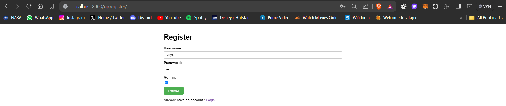
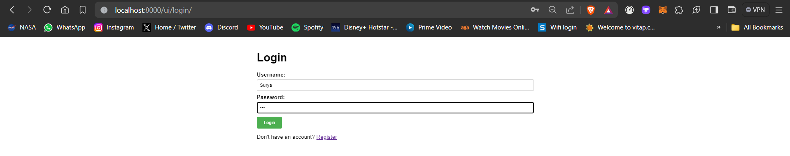
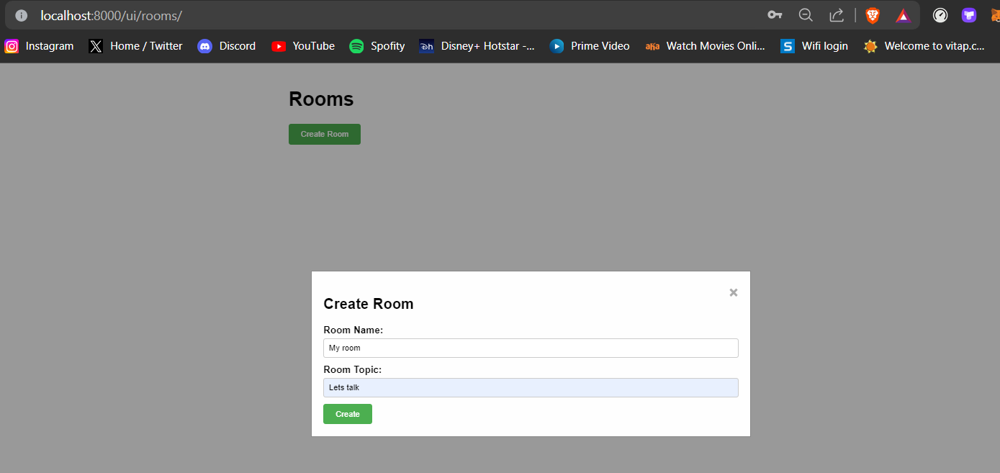
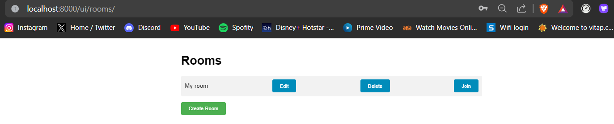
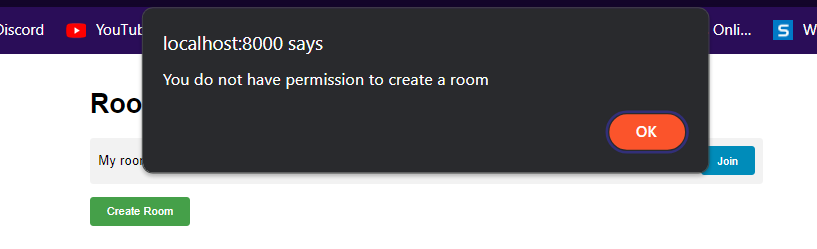
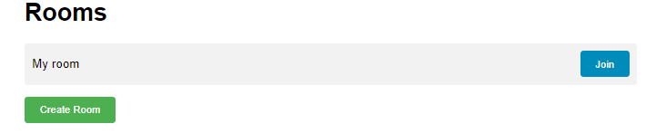
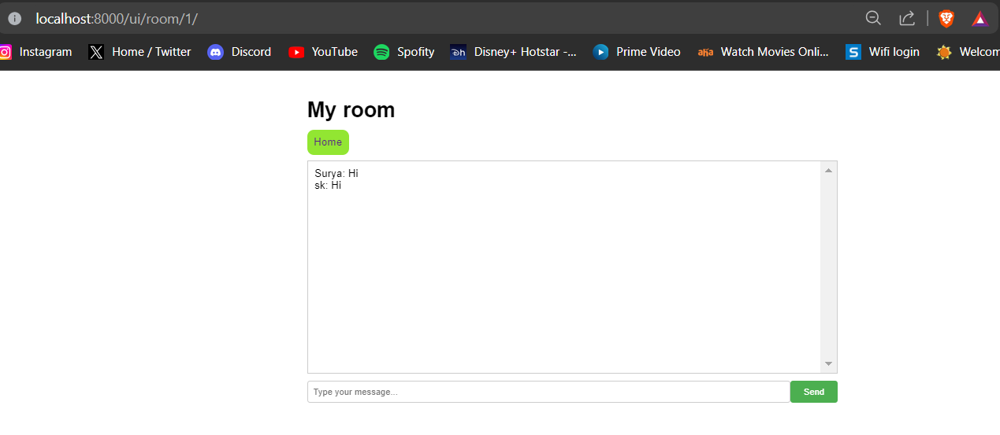

## Realtime Chat Application using DRF, Web sockets & UI

## Table of Contents
- [Introduction](#introduction)
- [Technologies Used](#technologies-used)
- [Overview](#Overview)
- [Cloning the Repository](#cloning-the-repository)
- [Installation](#installation)
- [Starting Docker](#starting-docker)
- [Building and Running the Application](#building-and-running-the-application)
- [API Documentation](#api-documentation)
- [Endpoints](#endpoints)
- [Images](#images)

## Introduction
My Application is a web service that provides various features using RESTful APIs. This document serves as a guide to install, run, and interact with the application using Docker and Docker Compose.

## Technologies used

- Django
- Django Rest framework
- Django Channels
- Html
- Css
- Javascript
- Mysql
- Web sockets
- Redis

## Overview

This application is a real-time chat platform developed using modern technologies like Django Rest Framework (DRF), Django channles, WebSockets and comes with Ui functionality. The platform enables users to sign up, log in, browse publicly available rooms, and join them to chat with others. Each room focuses on a specific topic, encouraging targeted discussions.

On the technical side, the backend employs Django Rest Framework (DRF) to develop RESTful API services, enabling seamless communication between the frontend and the backend systems. Meanwhile, the frontend utilizesJavascript to deliver dynamic and responsive user experiences. Furthermore, WebSockets enable instantaneous message delivery, simulating true real-time interactions amongst connected clients.

Some notable features of this application comprise user authentication, flexible room management, rich message history exploration, and reliable WebSocket communication. Altogether, the application aims to offer an engaging and interactive social networking space catering to numerous interests and communities.

- ### Models

    The application uses the following Django models to represent the entities involved in the Realtime meassing application:

    - **User**: Inherited Abstract user and extended a field `is_adminuser` which will help to check whether user is admin or not to allow him to create rooms or allowing him to crud on rooms.
    - **Room**: The Room model consists of fields `Room name`, `topic` and also have a `many-to-many` relationship with `user` model which will store the members in that room.
    - **Message**: The Message model consists of multiple foreign key fields with models `room` and `user` which will store the message according to the room and the user with the `content` field.


- ### API Endpoints and Implementation

    - **Endpoint Authorizations**: The endpoints are made in a way that the CRUD on Rooms can be done by only the Admin users.

    - **CRUD Operations**: Most models support Create, Read, Update, and Delete (CRUD) operations via DRF views such as `ModelViewset`

- ### Authentication and Security

    The application uses two types of authentication:

    - **Basic Authentication**: Used for some of the API endpoints, providing simple username/password authentication.
    - **Token Authentication**: Used for more secure authentication and session management. It provides token-based authentication for API requests.

    Security mechanisms in place include:

    - **Permissions**: DRF's `IsAdminUser`, `IsAuthenticated` and `AllowAny` permission classes are used to control access to endpoints.
    - **Authorization**: Ensures only the appropriate user can access or modify their data.


- ### Trade-Offs

    - **Simplicity vs. Flexibility**: The application design prioritizes simplicity and ease of use over extensive customization.
    - **Performance vs. Detail**: Uses `Django Channels` and `websockets` for realtime messaging with the help of `Redis` Channel layer which is an efficient method than the Database pooling mechanism.

    The design decisions and features are based on providing a straightforward and efficient realtime group messaging platform.


## Cloning the Repository
To clone the Git repository containing the application code:

```shell
git clone https://github.com/Suryakiran09/realtime_chatapp.git
```
```shell
cd almabaseca
```

## Installation
To get started with the application, you need to have Docker and Docker Compose installed on your system.

- **Docker:** Install Docker Desktop for Windows from the [official Docker website](https://www.docker.com/get-started).
- **Docker Compose:** Docker Compose is installed automatically with Docker Desktop. Check the [installation guide](https://docs.docker.com/compose/install/) for more information.

## Starting Docker
After installing Docker, Docker Desktop should automatically start on startup. You can check if Docker is running by looking for the Docker icon in the system tray.

## Building and Running the Application
To build and run the application, follow these steps:

1. **Clone the Repository:**
    Clone the Git repository containing the application code:

    ```shell
    git clone https://github.com/Suryakiran09/realtime_chatapp.git
    ```
    ```shell
    cd almabaseca
    ```

2. **Build the Application:**
    Use Docker Compose to build the application:

    ```shell
    docker-compose build
    ```

3. **Start the Application:**
    Start the application using Docker Compose:

    ```shell
    docker-compose up
    ```

The application will now be running and accessible at `http://localhost:8080/`.

## API Documentation

The API documentation can be accessed at the following URLs:

- **Swagger UI:** [Swagger UI](http://localhost:8000/swagger/)
  ```bash 
    http://localhost:8000/swagger/
    ```
- **ReDoc:** [ReDoc](http://localhost:8000/redoc/) 
  ```bash
    http://localhost:8000/redoc/
    ```

## Endpoints
Here are the available API endpoints with dummy JSON data for each endpoint:

This is the documentation for the Realtime Chat Application

- #### UI Endpoints

    1. Login Page - 
        ```bash
        http://localhost:8000/ui/login/ 
        ```
    
    2. Register Page - 
        ```bash
        http://localhost:8000/ui/register/ 
        ```
    3. Room list Page - 
        ```bash
        http://localhost:8000/ui/rooms/ 
        ```
    4. Room chatting Page - 
        ```bash
        http://localhost:8000/ui/room/<int>/ 
        ```

- #### Rest API Endpoints
    1. RoomViewSet:
       - **GET** `/rooms/` - Retrieve all rooms
       - **POST** `/rooms/` - Create a new room
       - **GET** `/rooms/<pk>/` - Retrieve a specific room
       - **PUT** `/rooms/<pk>/` - Update a specific room
       - **PATCH** `/rooms/<pk>/` - Partially update a specific room
       - **DELETE** `/rooms/<pk>/` - Delete a specific room
    
    2. CustomObtainAuthToken.as_view():
       - **POST** `/login/` - Obtain authentication token
    
    3. RegisterView.as_view():
       - **POST** `/register/` - Register a new user
    
    4. ListMessagesView.as_view():
       - **GET** `/messages/<int:room_id>/` - Retrieve all messages in a specific room
    
    5. CreateMessageView.as_view():
       - **POST** `/messages/create/<int:room_id>/` - Create a new message in a specific room


- #### Websocket Endpoint
    1. Messages:
        - `ws://localhost:8000/ws/chat/(?P<room_name>\d+)/$` - Receives message from the         websocket to the django channel layers and adds the message to the database
         providing realtime messaing functionality.

## Images

- #### Register Page
    

- #### Login Page
    

- #### Room Creation
    
    ##### Crud for Admin User
    
    ##### No Permission for Normal User to CreateRooms
    
    ##### No Crud for Normal User
    

- #### Room Page
    ##### Allowing Realtime chat functionality using Web sockets
    
